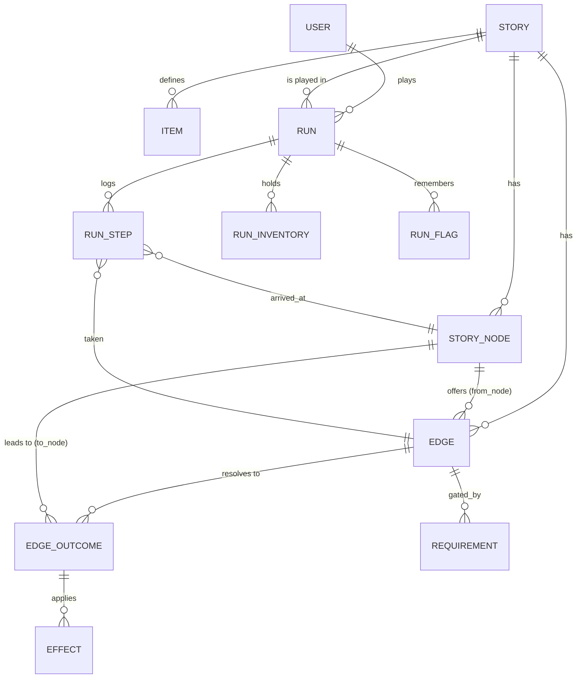

# StorySim → Stateful Text RPG — Design Doc

**Status:** Draft for review · **Author:** (design session) · **Scope:** turns the
collaborative branching story into an optional D&D-style text RPG with stats,
dice-rolled skill checks, items, HP, and per-player playthroughs.

---

## 1. Goals & non-goals

**Goals**
- Authors can make a choice into a **roll node** with 2–4 authored outcomes
  (crit-fail*, fail, success, crit-success*) — `*` optional.
- A choice can also just apply **direct effects** with no roll
  (e.g. "wade through the bug-infested jungle → −3 HP").
- Players have **persistent character state**: HP, six stats, an inventory, and
  story flags, evolving as they traverse the tree.
- Server-authoritative dice (no client cheating), with a full **roll/step log**.
- **Backwards compatible**: existing stories keep working untouched; the RPG
  layer is opt-in per story, and "linear" is just the degenerate case of the
  general model.

**Non-goals (for now)**
- Multiplayer/shared runs (state is per user per run).
- Combat sub-systems / turn order. A "fight" is modeled as roll nodes.
- Real-time anything.

**Guiding principle — separate three concerns that change at different rates:**

| Layer | What | Who owns it | Mutability |
|---|---|---|---|
| **Content** | passages of prose (`StoryNode`) | authors, shared | append-only |
| **Rules** | what a choice does: checks, branches, effects (`Edge`, `EdgeOutcome`, `Effect`) | authors, shared | append-only |
| **Player state** | HP/stats/inventory/flags for one playthrough (`Run`, `RunStep`, …) | one user, private | mutates constantly |

Keeping these strictly separate is what stops us getting "shot in the foot": new
mechanics become new **rows** (effect types, items) or new **config**, not schema
rewrites.

---

## 2. The big model shift: explicit Edges

Today a choice is implicit: a child node carries `parent_node_id` + `edge_prompt`,
and "the children are the choices." That can't express "one action, several
possible destinations depending on a die roll." So we promote the **choice** to a
first-class entity and split it from its **destinations**.



- **A plain choice** = an `Edge(kind='plain')` with exactly **one** outcome
  (`band='plain'`). The old linear story is exactly this. ✅ migration is mechanical.
- **A roll choice** = an `Edge(kind='roll')` with a check (`stat`,`dc`) and **2–4**
  outcomes keyed by result band.

### 2.5 Two modes: Story vs Campaign

The RPG layer changes the *vibe*, so it's framed as a content mode, not just a
mechanics flag. **Mechanics (`mode`) and cadence (publish schedule) are
orthogonal**, but paired by convention:

| | `mode = 'story'` *(today)* | `mode = 'campaign'` *(new)* |
|---|---|---|
| Vibe | a daily branching tale | a D&D-style adventure |
| Cadence (convention) | **daily** | **weekly / monthly** |
| Mechanics | plain edges only; no stats/HP | stats, HP, dice rolls, items |
| Player state | none (just "which node") | a saveable `Run` (HP/stats/inventory) |
| UI | reading view as-is | + character sheet, HP bar, dice, inventory |

Cadence is purely a *scheduling* concern (`Story.publish_date` already exists; a
campaign just publishes less often) — it adds **no schema**. The daily-generation
job gains a campaign variant later. Existing daily content stays `mode='story'`
and is completely unaffected.

### 2.6 Node kinds — the map vs. what happens *here* (Slay-the-Spire model)

Borrowing Slay the Spire's separation: **the map is the edge graph (navigation);
a node's `kind` decides what happens when you *arrive*.** Combat is *not* map
structure — it's an arrival behavior run by an engine. This is what keeps the
authored tree clean while still supporting fights.

`StoryNode.kind` (extensible string; behavior is a handler keyed off it, so new
kinds = new handler, **no schema change** — same philosophy as `Effect`):

| kind | On arrival | Then |
|---|---|---|
| `story` *(default)* | read prose, pick from authored choices (the StS `?` event) | follow the chosen edge |
| `combat` | engine runs a fight vs the node's `Encounter` | **victory →** node's normal edges become available; **defeat →** death policy (or an optional authored "defeat" edge for capture-not-death) |
| `rest` | apply restorative effects (heal, maybe upgrade) | follow edges |
| `treasure` | grant item(s) | follow edges |
| `shop` *(later)* | spend gold | follow edges |
| `boss` | `combat` variant (tougher encounter) | as combat |

Two distinct dice surfaces, complementary, both reusing the d20 + `Effect`
machinery:
- **Roll *edge*** (§2–4): a one-shot skill check resolving a *choice* on the way
  *out* (pick the lock, leap the gap) → branches by band.
- **Combat *node*** (§12): a sustained multi-round fight on *arrival* → win/lose
  loop, then rejoin the graph via edges.

The shadow-tree map renders each node with its kind's icon (🗡 combat, ❓ event,
🔥 rest, 💰 treasure, 👑 boss), just like StS.

### 2.7 Two lenses: play vs. build/author

A node is a **place**; a character is a **journey** through places. Only a *run*
has a character — a node/chain never does. This resolves "if you can write from
anywhere, whose character are you?": while browsing you are *no one's* character;
you only have a character inside a **run**, and a run always starts at the top and
goes **forward**. So the same map of places is seen through two lenses:

| | **Build / explore** (StoryView) | **Play** (a run, CampaignPlay) |
|---|---|---|
| Who you are | a level-designer / reader | your own character |
| Navigation | jump anywhere (map, URL) | forward only, from the root |
| State | none (no HP/character) | HP/stats/inventory accumulate |
| Choices | show their wiring (kind, check, effects); add/edit | **resolve** (roll/apply); lived |
| Purpose | author + curate the world | experience it as a journey |

**Authoring is level design, not playing.** Writing a branch off any node defines
a *rule for that place* (prose + check + effects) — you aren't claiming a
character stood there. Consequence: **prose stays state-agnostic** — describe the
place/event ("the water is rising"), never hard-coded numbers ("you have 3 HP");
mechanical state lives in the HP bar / effect chips. That guideline dissolves the
"this deep node assumes a wounded hero" problem.

Authoring happens **out-of-run** (the build lens, from anywhere — option A). An
immersive in-run "extend from where I stand" mode can layer on later (option B).
Daily `story`-mode stories have only the build/read lens (no character, no play).

---

## 3. Data model

### 3.1 Content & structure (shared, authored)

**`Story`** *(existing — add columns)*
- `mode: 'story' | 'campaign'` (default `'story'`) — see §2.5. `campaign` unlocks
  the RPG layer (stats/HP/dice/items, saveable runs).
- `death_policy: 'save_anywhere' | 'checkpoint' | 'permadeath'` (default
  `'save_anywhere'`).
- `active_edge_cap: int` (default `3`) — max in-play edges per choice point; see §13.
- *(optional later)* `starting_hp`, `starting_kit_id`, `class_options`, cadence,
  `promotion_interval`.

**`StoryNode`** *(existing — simplify)*
- Keep: `id, story_id, content, summary_so_far, user_id (author), created_at`.
- **Drop** `parent_node_id` and `edge_prompt` as the source of truth — structure
  now lives in `Edge`/`EdgeOutcome`. (We may keep a *derived* `parent_node_id`
  purely as a denormalized cache for the map; see §7.)
- `kind: str` (default `'story'`) — arrival behavior; see §2.6.
- Optional: `is_checkpoint: bool` (see §6 persistence).

**`Edge`** — a choice/action available from a node.
- `id`
- `story_id` *(denormalized for cheap per-story queries)*
- `from_node_id: FK StoryNode | NULL` — `NULL` = a choice off the story's opening
  blurb (today's "top-level" nodes).
- `label: str` — the choice text shown to the reader (was `edge_prompt`).
- `kind: 'plain' | 'roll'`
- `check_stat: 'str'|'dex'|'con'|'int'|'wis'|'cha' | NULL` *(roll only)*
- `check_dc: int | NULL` *(roll only)*
- `status: 'active' | 'candidate' | 'retired'` (default `'active'`) — only
  `active` edges are in-play/traversable; see §13 (branch economy).
- `created_by, created_at`

**`EdgeOutcome`** — where an edge leads, per result band.
- `id, edge_id`
- `band: 'plain' | 'crit_fail' | 'fail' | 'success' | 'crit_success'`
- `to_node_id: FK StoryNode` — destination passage.
- Uniqueness: one row per `(edge_id, band)`.
- Rules: `plain` edge → exactly one `plain` outcome. `roll` edge → `fail` +
  `success` **required**, `crit_fail`/`crit_success` **optional** (fall back to
  fail/success when absent).

**`Effect`** — a state mutation applied when an outcome is taken. *(The main
extensibility point — new mechanics = new `type` values, no schema change.)*
- `id, outcome_id`
- `type: 'hp_delta' | 'max_hp_delta' | 'stat_delta' | 'grant_item' | 'consume_item' | 'set_flag' | 'heal_full' | 'end_run' | …`
- `amount: int | NULL` (hp/stat deltas)
- `stat: str | NULL` (for `stat_delta`)
- `item_id: FK Item | NULL`, `count: int | NULL` (item effects)
- `flag_key: str | NULL`, `flag_value: str | NULL` (for `set_flag`)
- `meta: JSON` (escape hatch for future params)
- This unifies **stat-check rewards** and **direct modifiers**: "jungle −3 HP" is a
  `plain` edge whose single outcome has one `hp_delta:-3` effect.

**`Requirement`** — a gate to even *attempt* an edge *(optional in MVP)*.
- `id, edge_id, type: 'item'|'stat_min'|'flag', key, amount`
- `consume: bool` (default `false`) — if the requirement is an item, whether
  taking the edge consumes it. "Use the key on the door" → `consume=true`;
  "you need a torch to see" → `consume=false` (just must possess it).
- e.g. "needs `rope`", "needs STR ≥ 14", "flag `met_ferryman` = true".

**`Item`** — catalog of item definitions (shared).
- `id, story_id (NULL = global catalog), slug, name, description`
- `kind: 'consumable' | 'equipment' | 'key'`
- `on_use_effects: JSON | via Effect rows` — e.g. health potion → `hp_delta:+10`.
- Equipment may carry passive `stat`/`max_hp` modifiers (later).

### 3.2 Player state (private, per playthrough)

**`Run`** — one playthrough of one story by one user.
- `id, user_id, story_id`
- `current_node_id: FK StoryNode | NULL` (NULL = at the opening blurb)
- `hp: int, max_hp: int`
- `str, dex, con, int, wis, cha: int` *(the six core stats as columns — typed &
  queryable; exotic attributes can live in `RunFlag`)*
- `status: 'active' | 'dead' | 'won' | 'abandoned'`
- `last_checkpoint_step_id: FK RunStep | NULL`
- `started_at, updated_at`
- A user may have multiple runs of a story (history / restart) — `(user, story)`
  is **not** unique. Convention: one `active` run per `(user, story)` at a time.

**`RunStep`** — the append-only log of everything that happened, **with a state
snapshot**. This single table is the key to the persistence question (§6).
- `id, run_id, seq` (0,1,2,…)
- `edge_id: FK Edge | NULL` (the choice taken to produce this step; NULL for the
  initial "spawn" step)
- `arrived_node_id: FK StoryNode | NULL`
- `roll_d20: int | NULL`, `modifier: int | NULL`, `dc: int | NULL`,
  `band_result: str | NULL` (which outcome fired)
- `effects_applied: JSON` (audit of what changed)
- **`snapshot: JSON`** — full state *after* this step: `{hp,max_hp,stats,inventory,flags}`.
  Cheap (a few hundred bytes); makes rewind/restore to any step trivial.
- `created_at`

**`RunInventory`** — current live inventory (denormalized from the log for fast reads).
- `id, run_id, item_id, count` — unique `(run_id, item_id)`.

**`RunFlag`** — arbitrary boolean/string story state for this run.
- `id, run_id, key, value` — unique `(run_id, key)`. ("has_key", "spared_the_ghost".)

*(Inventory + flags are also captured in each `RunStep.snapshot`, so they're
restorable; the live tables are just the convenient "current" view.)*

---

## 4. Mechanics

### 4.1 Resolving a roll
1. Player takes an `Edge`. Server checks `Requirement`s (else 409 "can't yet").
2. If `kind='plain'` → fire the single outcome.
3. If `kind='roll'`:
   - `modifier = floor((stat - 10) / 2)` (D&D-style; stats ~8–18).
   - `roll = d20` (server RNG, logged).
   - **Band:** natural 20 → `crit_success`; natural 1 → `crit_fail`; else
     `roll + modifier ≥ dc` → `success` else `fail`.
   - If the chosen band has no authored outcome, fall back: `crit_*` → its base
     band (`success`/`fail`); base bands always exist.
4. Apply the outcome's `Effect`s in order → mutate `Run` (hp/stats/inventory/flags).
5. Set `current_node_id = outcome.to_node_id`; append a `RunStep` with snapshot.
6. If `hp ≤ 0` (or an `end_run` effect) → `status='dead'` and apply the death
   policy (§6).

### 4.2 Effects are data, not code
A small interpreter applies `Effect` rows by `type`. Adding "gain XP", "set
reputation", "teleport to node" later = a new `type` + a branch in the
interpreter. **No migration.**

### 4.3 Character selection — a curated, story-specific cast

The premise (the daily/curated blurb) **and** the playable cast are both curated
per story. Rather than a generic "Mage", a campaign offers 2–4 characters *themed
to its world* but built on shared mechanical **archetypes**, so flavor is
story-specific while balance stays consistent. e.g. *The Hollow Crown* →
the **Disgraced Knight** (warrior archetype), the **Tomb-Robber** (rogue), the
**Hedge-Witch** (mage).

- **`Story.character_mode: 'curated' | 'classes' | 'fixed'`** — `curated` (default
  for campaigns) shows the story's own cast; `classes` is the generic
  Warrior/Rogue/Mage fallback; `fixed` is a single pregen protagonist (no picker).
- A **`CharacterOption`** per story: `name`, `blurb`, `icon`, `archetype` (→ the
  shared stat/HP preset, today's `CLASS_PRESETS`), optional stat/HP overrides,
  `starting_items`. **Mechanics from the archetype; theming from the option.**
- **Generation:** the campaign generator (AI, alongside the premise) produces the
  themed cast. **Curated now; user-authored characters layer on later** — same
  table, just CRUD'd by authors.
- Selection happens at run start (root level); the picker renders the story's
  `CharacterOption`s (current code hardcodes `CLASS_PRESETS` — the `classes`
  fallback). Point-buy stays a possible future input method onto the same `Run`.
- Kept as **story metadata, not baked into node 0** — preserves the
  place-vs-character split (§2.7): a character is a *who*, node 0 is a *where*.
- `story`-mode (daily, non-RPG) skips character selection entirely.

---

## 5. Authoring flow

Creating a choice (in an RPG story) offers:
- **Plain** (the old way) — label + destination passage, optionally with direct
  effects (±HP, grant/consume item).
- **Roll** — pick `stat` + `DC`, then author the **fail** and **success**
  passages (required) and optionally **crit-fail** / **crit-success**. Each band
  gets its own prose + effects.
- **"Not creative enough" → linear:** the author just makes a Plain choice. The
  model needs no special "linear mode" — plain *is* linear.

**AI tie-in (recommended):** the existing `/ai/draft` can, for a roll edge,
propose a fitting `stat`+`DC` and draft the 2–4 outcome passages + effects from
the prose; the author edits before posting. Strong, on-brand use of Claude.

---

## 6. The persistence question — solved by the step log

The user raised three options. **Key realization:** if every `RunStep` carries a
full state `snapshot` (cheap), then *all three become a policy choice, not a
schema choice.* We log everything once and pick behavior with config.

| Policy | Behavior | Implementation on top of the step log |
|---|---|---|
| **Save anywhere** *(default)* | save/restore at any visited step | restore any chosen `RunStep.snapshot`; mark later steps `undone`; optional named save slots |
| **Checkpoints** | restore to last checkpoint on death | mark some outcomes/nodes `is_checkpoint`; `Run.last_checkpoint_step_id`; on death restore that step's snapshot, truncate later steps |
| **Permadeath** ("you die, you die") | death ends the run; start fresh | on death set `status='dead'`; reads block; new `Run` to replay |

**Decision:** ship the **step-log-with-snapshots** schema now and default
`death_policy` to **`save_anywhere`** (most flexible — players save/restore at
any visited step; the natural fit for a longer weekly campaign). `checkpoint` and
`permadeath` remain available per story without any schema change.

**Save UX for `save_anywhere`:** every step is implicitly snapshotted, so "Save"
is really "name/bookmark this step" and "Load" restores its snapshot (later steps
marked `undone`). We can also offer named save slots on top of the same log.

**Immersion note:** free restore lets a player re-roll a failed check by loading
and retrying. For campaigns where that matters, an author can set
`death_policy='checkpoint'` (restore only at checkpoints) or `'permadeath'`. The
default favors flexibility per the product direction; the knob is per story.

---

## 7. How existing features map

- **Shadow-tree map:** built from `Edge`/`EdgeOutcome` instead of `parent_node_id`.
  A node's children = `to_node` of its edges' outcomes. Roll edges fan out to up
  to 4 children; render them with a 🎲 marker and band labels. We can keep a
  derived `parent_node_id` cache on `StoryNode` so the map/path queries stay cheap.
- **Path / breadcrumb:** for a *run*, the path is the ordered `RunStep`s (what you
  actually rolled) — strictly better than structural parent-walk. For anonymous
  browsing (no run), fall back to the structural tree.
- **Votes / views:** unchanged — still per-`StoryNode` aggregates. (Could add
  edge-level voting later.)
- **Linear stories:** `mode='linear'`, all edges `plain`, no Run required to read
  (or a trivial run with no stats/HP shown). Zero UX change for them.

---

## 8. Migration plan (Alembic + data backfill)

1. Add new tables (`edges`, `edge_outcomes`, `effects`, `items`, `runs`,
   `run_steps`, `run_inventory`, `run_flags`, `requirements`) + `stories.mode`.
2. **Backfill** from current data: for every `StoryNode` with a parent, create
   `Edge(from_node_id=parent, label=edge_prompt, kind='plain')` + one
   `EdgeOutcome(band='plain', to_node_id=node)`. Root-level nodes → edges with
   `from_node_id=NULL`. No content is lost; every current path becomes a plain edge.
3. Leave `parent_node_id`/`edge_prompt` in place initially (as the derived cache),
   drop later once the edge model is proven.
4. All existing stories stay `mode='linear'` → no behavior change.

---

## 9. API surface (new / changed)

```
# authoring (RPG)
POST   /api/stories/{id}/edges            create a choice (plain or roll + outcomes + effects)
GET    /api/nodes/{id}/edges              choices available at a node
POST   /api/ai/draft-roll                 AI proposes check + outcome drafts

# playing
POST   /api/stories/{id}/runs             start a run (pick class/preset) -> Run
GET    /api/runs/{id}                     current state (hp, stats, inventory, flags, node)
POST   /api/runs/{id}/take/{edge_id}      attempt an edge -> {roll, band, effects, new node, state}
POST   /api/runs/{id}/use-item/{item_id}  consume an item -> effects applied
POST   /api/runs/{id}/restore/{step_id}   rewind/checkpoint restore (policy-gated)
GET    /api/me/runs                        my playthroughs (extends the profile/history feature)
```

Reading endpoints (`/nodes/{id}`, tree, path) gain an optional `?run_id=` so the
view can reflect run state (locked edges, requirements, current HP).

---

## 10. Phased rollout (per-feature commits)

1. ✅ **Schema + migration + backfill** — new tables, `Story.mode`, edge backfill;
   no UI yet. Verified existing app still works on the edge-backed model.
2. ✅ **Edge-backed reading** — switched the read/tree/path endpoints to edges
   (all plain). Frontend unchanged. (De-risked the big refactor before adding RPG.)
3. ✅ **Runs + HP + class presets** — start a run, HP bar + character sheet UI,
   `take-edge` for plain edges applying direct effects (the "−3 HP jungle").
4. **Roll edges** — ✅ engine (server dice + bands); ▶ play-view roll display +
   roll-edge authoring in build mode.
5. **Curated character cast** (§4.3) — per-story `CharacterOption`s (themed
   archetypes), picker reads them, AI generates the cast with the premise.
6. **Items & inventory** — catalog, grant/consume, use-item, health potion;
   `Requirement` gates incl. `consume` (use-the-key vs must-possess).
7. **Branch economy** (§13) — `Edge.status`, active cap of 3, candidate voting,
   lazy on-read promotion + `/admin/promote`, canonize-on-depth, never-delete.
8. **Death policy** — save-anywhere save/restore UI; optional checkpoint/permadeath.
9. **AI roll-drafting** — Claude proposes checks + outcome prose.

---

## 11. Decisions

**Settled**
- ✅ **Modes:** `story` (daily, light) vs `campaign` (RPG, weekly/monthly). §2.5
- ✅ **Persistence:** snapshot-per-step log; default `death_policy='save_anywhere'`,
  per-story override. §6
- ✅ **Edge refactor:** do the full content→edge migration (Phases 1–2) for a clean base.

**Still to confirm (low-stakes; recommended defaults in parens — I'll proceed on
these unless you say otherwise):**
1. **Stat scale & modifier** — *(D&D-style 8–18 stats, `floor((s-10)/2)` mod, d20 vs DC)*
2. ✅ **Character selection** — per-story **curated cast** (themed reskins of
   shared archetypes), AI-generated with the premise; user-authored later. §4.3
3. **Crit rule** — *(natural 1/20 → crit bands, else fall back to fail/success)*

---

## 12. Future epics & forward-compatible hooks

We don't build these now, but the schema reserves cheap hooks so they bolt on
without a remodel.

### 12.1 Party (solo player, multiple PCs)
**Hook now:** put per-character state in a **`RunCharacter`** table rather than on
`Run` (ship MVP as a party of 1 — a party is just N of these). Add `node.kind`
(done above).

When enabled, add two fields:
- **`Edge.resolution: 'one' | 'all'`** *(your model)*:
  - `one` — player picks which PC attempts the check; that PC's stat is rolled.
  - `all` — applies to the whole party. Each PC rolls; **navigation** is decided
    by an author-chosen aggregate (`Edge.all_aggregate: 'all_pass' | 'majority'`,
    default `all_pass`), while **effects apply per-character** by each PC's own
    result (the "everyone roll a DEX save — those who fail take the damage"
    moment). Navigation = the party as a whole; effects = each PC individually.
  - Party-of-1 collapses both to "the one PC."
- **`Effect.target: 'actor' | 'party' | 'character'`** — trap hits the actor;
  collapsing ceiling hits the party.

Death with a party: a PC at HP ≤ 0 is `down/dead`; the run ends only on a TPK
(or an authored capture/defeat edge). Snapshots already cover all PCs.

**Co-op multiplayer (multiple *users* in one run) is explicitly out of scope** —
it needs shared-run concurrency, turn ownership, and presence, which breaks the
async model. Different epic entirely.

### 12.2 Combat (engine-driven, Slay-the-Spire-style)
Combat is a **loop**, not an edge → it can't be authored as nodes. It's an engine
interlude entered at a `kind='combat'` node (§2.6).

- **`Enemy`** (catalog, like `Item`): `story_id, name, stats, hp, max_hp,
  attacks[], abilities, ai_hint`.
- **`Encounter`** (authored, attached to a combat node): enemy list + counts,
  `ambush`, `can_flee`, optional authored `defeat_outcome` (capture vs death).
- **`RunCombat`** (live state, captured in the step snapshot so save-anywhere
  works mid-fight): enemy current HP, turn order, round, whose turn.
- **Action API:** `POST /runs/{id}/combat/action {attack|item|flee|ability,target}`
  — engine resolves the round (to-hit d20+mod vs defense, damage, simple enemy
  AI like "target lowest-HP PC"), applies `Effect`s, logs a
  `RunStep(band='combat_round')`, checks win/lose/flee.
- **Resolution rejoins the graph:** victory → the node's normal edges; defeat →
  death policy (or the authored defeat edge).

Combat reuses the dice + `Effect` machinery; the new weight is the turn loop,
targeting, enemy AI, status effects, and a combat UI. Treat as its own epic
(roughly the size of Phases 1–7 combined).

---

## 13. Branch economy — in-play vs candidate paths

**Problem:** open contribution makes popular nodes go 200-wide and shallow. We
want depth over breadth: a small canonical set of choices per node, with the rest
as votable proposals that can earn their way in.

**Model:** `Edge.status: active | candidate | retired`.
- Players traversing the story see/take only **`active`** edges — capped at
  `Story.active_edge_cap` (default **3**) per *choice point* (a `from_node`, or
  the story root for top-level edges).
- New submissions: if the choice point has a free active slot → seated `active`;
  otherwise filed as **`candidate`** (shown in a "proposals" area, votable).
- Candidates are voted on at the **edge** level (reuse the vote machinery,
  targeting edges rather than only nodes).

**Promotion / relegation — the rules that protect depth:**
- **Canonize-on-depth:** an `active` edge that already has descendants (a subtree
  was built on it) is **protected** — it cannot be unseated. Competition flows to
  undeveloped slots; building deep is what makes a branch permanent. *This is the
  core rule that delivers "deeper and richer."*
- **Never delete:** a relegated edge becomes `candidate`/`retired`, never removed.
  It stays explorable as an *alternate* path (already fits the dim "shadow tree").
  Authored work is never destroyed, and a run's step log preserves any path a
  player actually took even if it's later relegated.
- **Promotion bar:** a candidate is seated only when it beats the weakest
  *unprotected* active edge by a margin (hysteresis — avoids constant swaps).

**Promotion timing — lazy, no worker:**
- Store a `next_promotion_at` per choice point (column on the `from_node`, plus a
  story-level value for the root). Evaluate **on read**: when a choice point's
  proposals are fetched, if `now ≥ next_promotion_at`, run the promotion for that
  point, advance the timestamp, then serve. No daemon, no queue — promotions
  happen just-in-time, driven by traffic. A node nobody visits never promotes
  (nobody's waiting).
- A manual **`POST /api/admin/promote`** triggers it on demand (control/testing).
- If the app is ever deployed and wants guaranteed cadence for cold nodes, a
  single platform/OS cron entry can call that same endpoint — the lazy path and
  the cron call the **same** promotion function, so nothing is throwaway.
  (Mirrors the existing `generate_daily` script + `/admin/generate-daily` pattern.)

**Phase:** its own phase (authoring/curation, mostly orthogonal to the run
engine). Cheap hook reserved now: the `Edge.status` column.
